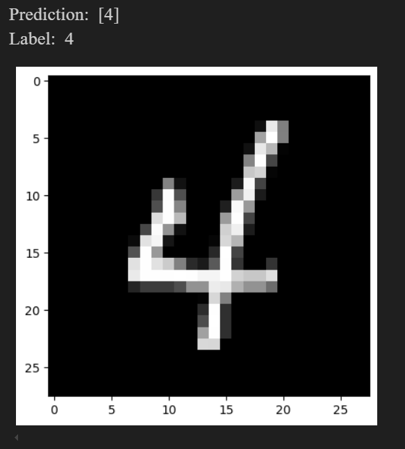
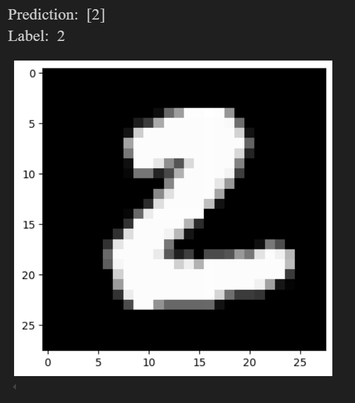
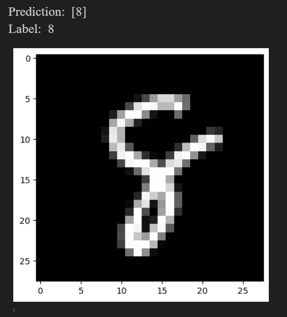

# Simple Neural Network from Scratch

A fully connected **3-layer neural network** built from scratch using only **NumPy and Pandas**. This project extends an existing 2-layer model by adding an extra layer, improving its learning capability.

## Features
- Fully connected neural network with **ReLU** and **Softmax** activation  
- **Backpropagation & Gradient Descent** for training  
- Tested on the **MNIST handwritten digits dataset**  
- **No external ML libraries** like TensorFlow or PyTorch  

## Dataset
The model is trained on the **Digit Recognizer** dataset from Kaggle:  
[Download train.csv from Kaggle](https://www.kaggle.com/c/digit-recognizer/data?select=train.csv)  
Or download the zipped version from this repo.

**Usage:**
- Place `train.csv` in the project directory.  
- Run the Jupyter Notebook to train the model.  

**Screenshots:**

